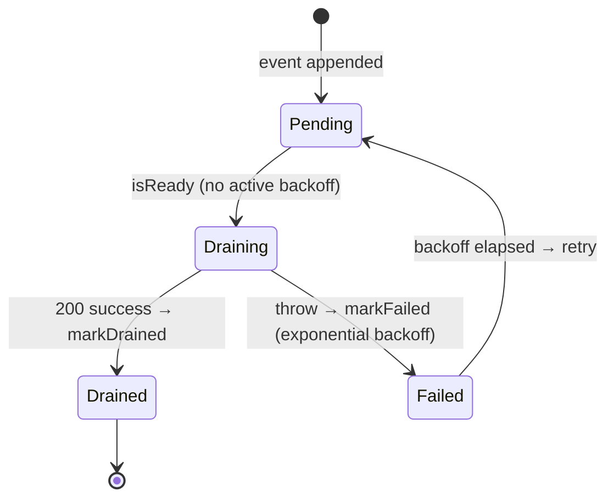

# ADR-0009 — Convex as an opt-in cloud control plane (metadata only, never bytes)

- **Status:** Accepted (2026-06-11)
- **Extended by:** [ADR-0018](0018-capture-mirror-extends-convex-scope.md) — the
  "metadata only — never bytes, captures, or auth" posture below scopes the **media**
  mirror. The Tweet Harvest capture mirror extends the Convex scope to tweet **text**
  (+ link metadata; still never media bytes/captures/auth), behind its own opt-in
  `captureMirrorEnabled` (default OFF).

## Context

Users want durable, cross-session/cross-device visibility into what was grabbed
(a URL/state cache, a job ledger that survives browser close) and, later, cloud
export of selections to S3/Drive/Photos/Dropbox. Two constraints shape any
remote backend here:

- **Product promise:** default operation is local-first and has no telemetry.
  Captures are sensitive, durable local IndexedDB records with an explicit erase
  control (ADR-0005). A remote backend must be **opt-in** and must never receive
  auth headers or media bytes. ADR-0018 separately governs the opt-in Capture
  text mirror.
- **Convex platform facts** (verified against docs.convex.dev, 2026-06):
  HTTP actions cap request/response at 20 MiB; actions are at-most-once and not
  auto-retried; **scheduled mutations are exactly-once with automatic retries**;
  a mutation may write ≤16 MiB / ≤16,000 docs and schedule ≤1,000 functions;
  query/mutation user code is capped at 1 s. Convex is a strong reactive
  metadata + durable scheduling platform and a poor 1k–10k-file byte pipe.

## Decision

Convex becomes a **sidecar control plane**, three-layered:

1. **Local execution layer (unchanged):** browser/aria2 own all media bytes
   (ADR-0002/0003/0006). Default behavior is byte-for-byte what it is today.
2. **Metadata/orchestration layer (new, opt-in):** the background SW mirrors
   append-only **Sync Events** (`queued` / `completed` / `failed`, metadata
   only) into Convex through a local **Outbox**:
   - Events carry a deterministic, length-prefixed v1 `eventId` so server
     writes are **idempotent**; re-sending a batch is harmless. The server
     accepts the old slash form only while older durable outboxes drain. That
     compatibility path requires slash-free UUID device IDs and media basenames.
   - The Outbox persists to `storage.local`, drains FIFO in batches of ≤64 via
     `POST {deployment}/api/mutation` (`sync:recordEvents`), and backs off
     exponentially on failure. A new worker bounds a persisted retry deadline
     from its durable failure count, so wall-clock rollback cannot create an
     unbounded sleep. Downloads never block on, or fail because of, the cloud.
   - A corrupt durable Outbox is quarantined in place. Sync shows an error and
     clears its retry alarm. Turning Cloud Sync off explicitly clears the data.
   - Transport is a minimal `fetch`-based port over Convex's public HTTP API
     (the `makeAria2RpcPort` pattern) — **no convex npm dependency, no
     WebSocket client** in the MV3 worker.
3. **Byte-transfer layer (future, Phase 3):** provider-native resumable/
   multipart uploads (S3, Drive, Photos, Dropbox). Bytes never transit Convex.

Privacy/permissions posture:

- Default **off** (`cloudSyncEnabled: false`). The `https://*.convex.cloud/*`
  origin is an **optional** host permission requested at runtime on enable
  (aria2-localhost precedent). The popup footer says "Cloud sync on · metadata
  only" while enabled — the product is described as local-first, never local-only.
- Mirrored data is CDN URLs + tweet/handle/type provenance only. Sidecar
  `data:` URLs, captures, and auth material are structurally excluded by the
  `SyncEvent` schema. Disabling sync clears the Outbox.
- An optional shared secret (Convex env var `SYNC_SHARED_SECRET`) gates the
  public mutation.

## Data flow

```mermaid
sequenceDiagram
  autonumber
  participant CS as Content script
  participant BG as Background SW
  participant OB as Outbox (storage.local)
  participant CX as Convex /api/mutation
  participant DB as sync_events + media_state
  participant PU as Popup

  CS->>BG: download event (queued / completed / failed)
  Note over BG: gate — cloudSyncEnabled + URL + secret
  BG->>OB: append SyncEvent (eventId = v1(device, request, kind))
  BG-)BG: drainOutbox (fire-and-forget; download never blocks)
  loop FIFO, batch ≤64, until empty or first failure
    BG->>CX: POST sync:recordEvents {events, secret}
    Note over BG,CX: fetch bound to globalThis<br/>(else "Illegal invocation" in the SW)
    CX->>CX: secret === SYNC_SHARED_SECRET (fail-closed)
    CX->>DB: skip seen eventId, else insert + patch media_state
    CX-->>BG: {received, inserted}
    BG->>OB: markDrained
    BG->>PU: status "Connected ✓"
  end
```

Outbox batch lifecycle:



> **Implementation note — service-worker `fetch` receiver.** The HTTP port must
> call the injected `fetch` **detached from its config object**. `cfg.fetchImpl(...)`
> invokes native `fetch` with `this === cfg`, which the MV3 service worker rejects
> with `TypeError: Failed to execute 'fetch' on 'WorkerGlobalScope': Illegal
> invocation` — the request never leaves the worker, so "Test connection" reports
> "Could not reach the deployment" even though the backend is healthy. Bind at port
> construction: `const doFetch = cfg.fetchImpl.bind(globalThis)`. Arrow-function test
> mocks ignore `this` and miss this entirely; the regression guard is a non-arrow
> brand-check stub (`convex.test.ts`, `aria2.test.ts`). Same fix applies to
> `makeAria2RpcPort`.

## Consequences

- Local-first default mode is untouched; cloud mode gains a durable,
  device-tagged ledger and URL/state cache that survives browser restarts.
- Idempotent events + at-least-once draining give exact-once _effects_ without
  distributed transactions; append-only rows avoid Convex hot-document write
  conflicts.
- Prolonged offline beyond the Outbox cap (2,000 events) drops oldest metadata
  — acceptable; bytes were already safe on disk.
- The Convex backend lives in `backend/` as a separate package; the extension
  bundle and root typecheck do not depend on it.

## Alternatives considered

- **Convex JS client (`ConvexClient`/`ConvexHttpClient`) in the SW** — adds a
  dependency and (for the reactive client) a WebSocket whose lifetime fights SW
  recycling; the raw HTTP API needs ~40 lines.
- **Convex as the byte pipe** (HTTP actions / file storage relay) — 20 MiB
  action cap, at-most-once actions, storage+egress billing; wrong primitive
  for 1k–10k PNG/MP4 transfers.
- **Mirroring whole queue/metrics blobs** — overwrites one hot document per
  tick (write conflicts, no audit trail); append-only events chosen instead.
- **Mandatory cloud backend** — breaks the product's local-first, optional-cloud posture.
