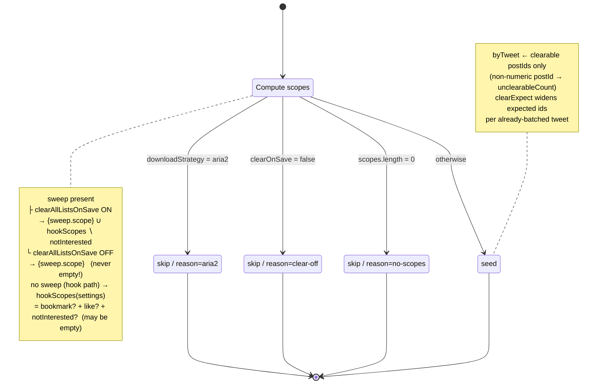
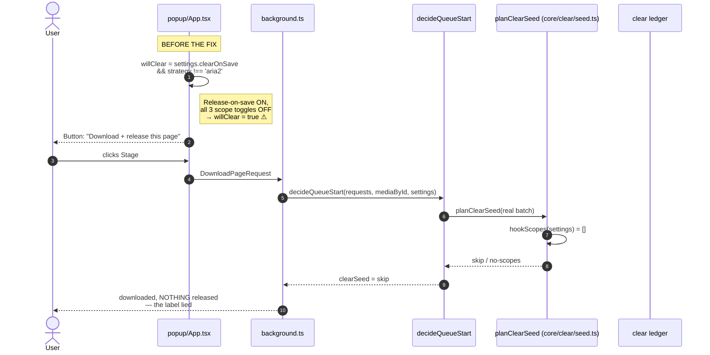
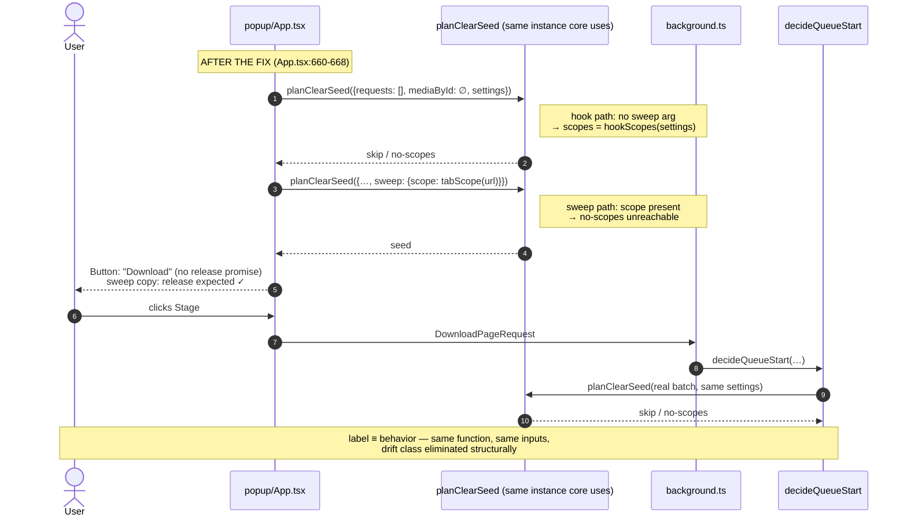
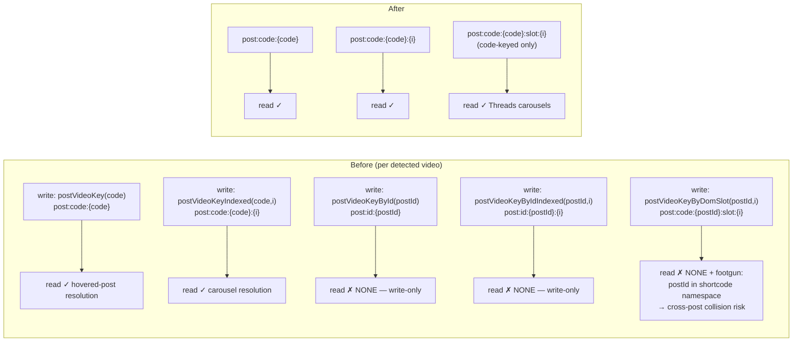
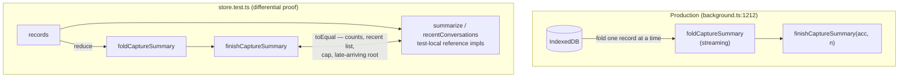
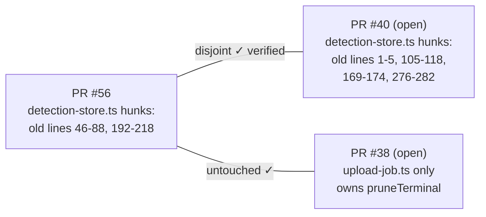

# Technical Review Report — PR #56: Arch Loop Rounds 7–8

| | |
|---|---|
| **PR** | [#56 — Arch loop rounds 7-8: fix popup release-gate drift, delete verified-dead code](https://github.com/fpcMotif/xediadownloader/pull/56) |
| **Merged** | 2026-07-18 into `main` (commits `8d066e73`, `44f4a80c`, `d80addf7`) |
| **Reviewed** | 2026-07-19, read-only, against merged `main` |
| **Verdict** | **APPROVE** — all load-bearing claims verified; zero CRITICAL findings |
| **Gate evidence** | `bun run check` → 122 files / **1675 tests green** (oxfmt + oxlint + `tsgo --noEmit` + vitest) · `bun run build` → chrome-mv3 bundle OK (779.83 kB) |

---

## 1. Executive Summary

PR #56 is the output of two autonomous architecture-review rounds. It contains **one live UI-correctness bug fix** and **one large verified dead-code deletion** (−306 net lines), plus a glossary de-drift pass. The review re-verified every claim adversarially against the merged tree: every deleted symbol is provably dead, the differential test's proof obligation is intact, and the popup now shares core's single source of truth for the release gate.

The PR fixes three classes of bad structure:

1. **Dual derivation of a business rule** — popup copy and core gate each computed "will a save also release?" independently; they drifted.
2. **Write-only state + speculative generality** — produced-but-never-consumed hover keys, a test oracle shipped in the production bundle, and a fully tested Selection model that was never wired.
3. **Documentation describing aspirations** — CONTEXT.md described a clock injection as "not yet built" when it had shipped.

---

## 2. The Release-Gate Drift Bug (commit `8d066e73`)

### 2.1 The gate: `planClearSeed` decision state machine

The real release gate lives in `src/core/clear/seed.ts:36`. It maps `(requests, mediaById, sweep?, settings)` to a `ClearSeedVerdict`:

Key asymmetry, pinned by `seed.test.ts:151-208`: a **sweep always carries its own list scope**, so `scopes.length ≥ 1` and the `no-scopes` skip is unreachable for sweeps. The **hook path** (auto-download on save) derives scopes purely from the three per-scope toggles (`ledger.ts:177`) and **can** hit `no-scopes`.

### 2.2 The bug: two derivations, one drifts

The popup computed its button label from raw settings — `clearOnSave && strategy !== 'aria2'` — a **second, weaker derivation** missing the `no-scopes` check:

### 2.3 The fix: dry-run the real gate

The popup now asks the gate itself. `planClearSeed` with an empty batch is pure and executes *exactly* its skip checks — the loops over `requests`/`mediaById` are no-ops — so the label is the verdict:

**Why this kills the drift class, not just the instance:** any future change to the skip logic (new reason, new scope rule) now applies to label and behavior simultaneously, because both read the same function. The scope inputs also converge: the popup's `tabScope(url)` and the content script's `handleSweepPage` (`handlers.ts:356`) both derive the sweep scope via the same `pageScope(pathname)`.

### 2.4 Assessment

- The fix is correct and minimal; `planClearSeed` is pure, so the dry-run has no side effects (verified by reading `seed.ts` end to end).
- **WARNING:** the fix has no direct test — commit `8d066e73` touched only `App.tsx`. The drift scenario is pinned at the gate level (`seed.test.ts:53`, no-scopes skip) but not at the label level. The PR itself flags the fix as *not browser-verified*; a popup-level test or an extension reload + eyeball (Release-on-save ON / all scopes OFF) is the owed follow-up.
- **NITPICK:** `aria2Caveat` (`App.tsx:670`) still re-derives from raw settings. The dry-run verdict already carries the skip `reason` — the caveat could ask the gate too, eliminating the last second reader of those two fields.

---

## 3. Verified Dead-Code Deletion (commit `44f4a80c`)

Each deletion was re-verified against the merged tree: **zero surviving references in `src/`** for every removed symbol (grep + typecheck via the gate; `tsgo --noEmit` would fail on any surviving import).

### 3.1 Detection store: write-only keys + namespace footgun

Before the fix, `makeDetectionStore` maintained two parallel key families per video; production resolution only ever queried the code-keyed family (a DOM walk yields a shortcode, never a raw postId):

Post-merge, `post:id:` has **zero occurrences** in `src/`, and `postVideoKeyByDomSlot` is called with `code` only (`detection-store.ts:191,198`). The retained tests were updated to pin the code-keyed behavior (`detection-store.test.ts`), including that the no-index key stays absent for multi-video posts.

### 3.2 Capture store: test oracle relocated out of the production bundle

`summarize`/`recentConversations` shipped in production solely so the differential test could pin the streaming fold against a simple materialized reference. They moved into `store.test.ts`; the proof obligation is unchanged:

`decodeRecords` was deleted outright: the IndexedDB read path never decodes, so both it and its tests were unreachable. Proof intact at `store.test.ts:220-257` (counts, recent-list cap, late-root overwrite, empty store).

### 3.3 The Selection model: tested, never wired

`src/core/selection.ts` (78 lines) + `selection.test.ts` (132 lines) + `groupByTweet` in `x/dom.ts` formed a complete, fully tested domain model — with **zero production callers**. Deleted together with its CONTEXT.md glossary noun. This is the classic *speculative generality* / code-as-inventory smell: every line carried coverage-gate and review cost while delivering nothing.

### 3.4 Five test-only / unwired exports

| Deleted | From | Why dead |
|---|---|---|
| `toRows` / `Row` | `core/capture/export.ts` | Fourth export format; the Notion/Sheets seam it served was never built |
| `mergeRetryUrl` | `core/download/media-url-refresh.ts` | No caller |
| `outcomeFromState` | `core/download/metrics.ts` | No caller |
| `getIntroState` | `popup/first-run.ts` | No caller |
| `DownloadIcon` | `components/icons.tsx` | No JSX usage |

The commit is genuinely deletion-only on the production side (3 added lines are comment rewords); test-file additions are updated pins for retained behavior. No smuggled logic changes.

---

## 4. Docs De-Drift (commit `d80addf7`)

CONTEXT.md's glossary was corrected against the code:

- **Settle clock**: the entry claimed "raw `setTimeout`… not yet built"; the code has `SettleClock` injected via `deps.clock ?? realSettleClock` with a hand-rolled fake in tests. Verified at `clear-session.ts:53,59,148,153`.
- **Watchdog decision recorded**: the stuck-download watchdog's `setInterval` stays inline in `entrypoints/background.ts:821` by explicit round-7 decision (no duplication, defense-in-depth exists) — recorded so future review rounds stop re-proposing its extraction.
- **Selection noun dropped** with the deleted model.

**WARNING (self-inflicted drift):** the corrected entry says "`SettleClock` in `clear-coordinator.ts`" — that file no longer exists; PR #54 renamed it to `src/background/clear-session.ts` hours earlier. The de-drift commit shipped a stale filename.

**WARNING (de-drift scope):** two living documents were left describing deleted code, against the PR's own stated principle ("the glossary describes the system, not aspirations"):

- `docs/testing/2026-06-12-unit-test-design.md` — still catalogs `core/selection` (§2.6, line 134), the `groupByTweet` pin (DOM-N7), `outcomeFromState` (MET-N9), and `core/selection` in its module table (line 413).
- `docs/superpowers/specs/2026-06-27-tweet-harvest-capture-design.md:253,332` — still specifies `decodeRecords`/`summarize`/`recentConversations` as the store contract and the `toRows` "define Row now" seam.

(`docs/plans/*` and handoffs are dated historical records — correctly left alone.)

---

## 5. Cross-PR Coexistence (reviewer-notes claims)

- **PR #40**: `detection-store.ts` hunks verified disjoint from #56's. Both touch `detection-store.test.ts` in nearby regions — "trivial rebase" is fair, not free.
- **PR #38**: `pruneTerminal` and the `CloudDestination` seam (ADR-0013) genuinely untouched.

---

## 6. Findings Summary

| Severity | # | Finding | Location |
|---|---|---|---|
| WARNING | 1 | De-drift commit introduced fresh drift: cites `clear-coordinator.ts`, renamed to `clear-session.ts` by PR #54 | `CONTEXT.md:89` |
| WARNING | 2 | Popup fix has no direct test; drift scenario pinned at gate level only; not browser-verified | `App.tsx:650-668` |
| WARNING | 3 | Living docs left stale: unit-test-design catalogs deleted `core/selection`; capture spec still specifies deleted exports | `docs/testing/2026-06-12-unit-test-design.md:134`; capture spec `:253,332` |
| NITPICK | 4 | `aria2Caveat` still re-derives from raw settings; the dry-run verdict already carries the skip `reason` | `App.tsx:670` |
| NITPICK | 5 | Test-file overlap with open PR #40 — rebase trivial, not free | `detection-store.test.ts` |
| CRITICAL | — | none | |

## 7. Verdict

**APPROVE.** Every load-bearing claim survived adversarial re-verification: deletions are provably dead (grep + typecheck + 1675 green tests), the differential proof is intact, the release gate has one source of truth, and both gates pass on merged `main`. Findings 1–3 are a small follow-up commit (doc filename, popup label test, stale spec annotations), not blockers.

**Owed follow-ups:**
1. Fix `CONTEXT.md:89` filename → `src/background/clear-session.ts`.
2. Browser-verify the popup label with Release-on-save ON / all scopes OFF (PR's own caveat).
3. Annotate or update the two stale living docs (finding 3).
